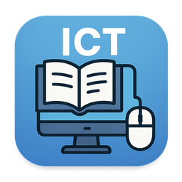

# IT-with-AMMAR
learning platform (App) for O/L ICT 

## 🚀 Features
* just all features an O/L ICT student needs 
* unit wise ext book and other resources
* past papers in an easy to navigate mind map
* unit based extra resources
* model papers
* Built in White board 
* Excel simulater
* Base converter
* Storage converter
* and more....

## just install and try it.

## 📩Download links
* **[IT with AMMAR.EXE]([https://github.com/kangax/html-minifier](https://github.com/AMMARLAFIR/IT-with-AMMAR/blob/main/it-with-ammar_0.1.0_x64-setup.exe))**

## screenshots

## Android version in development 

| screenshot 1 | screenshot 2 |
|---|---|
|||

# 📜 License
this project is free for personal use. using the code or selling or any other uses need a proper written permission. otherwise considered as an intellectual property theft.
