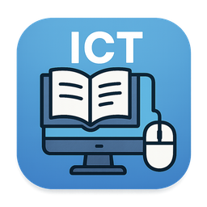

  

<h1 align="center">IT-with-AMMAR</h1>

An all-in-one interactive platform tailored for Grade 10 & Grade 11 students preparing for their O/L ICT (Information & Communication Technology) examinations.

IT with AMMAR simplifies complex IT concepts into engaging, interactive, and easily digestible learning materials. Guided by experienced educator and IT administrator AMMAR LAFIR, this platform bridges the gap between theoretical syllabus topics and practical technology skills.
# Key Features & Capabilities

## ​🧠 1. Unit-Based Learning & Interactive Mind Maps
​Grade 10 & Grade 11 Coverage: Complete chapter-by-chapter breakdowns for the entire syllabus.
​Visual Mind Maps: Connect key concepts, understand structural flows, and perform quick revisions at a glance before exams.

## 🛠️ 2. Interactive Learning Tools & Simulators

​Master practical concepts without installing heavy desktop software directly from your browser:
​Word Simulator: Practice document formatting, styling, and text processing.
​Excel Simulator: Master formulas, data analysis, spreadsheets, and charts interactively.
​Base Converter: Seamless real-time conversion between Binary (Base 2), Octal (Base 8), Decimal (Base 10), and Hexadecimal (Base 16).
​Storage Converter: Easily convert data units across Bytes, KB, MB, GB, and TB for capacity calculations.
​Logic Gate Simulator: Visualize and test digital logic circuits (AND, OR, NOT, XOR gates).
​Live HTML Editor: Write and test front-end code with live, instant side-by-side previews.
​
## 📚 3. Dual-Language Study Reference Guides

​Bilingual Support: Access study guides in both English and Tamil (தமிழ்).
​PDF Reference Viewer: Built-in fast document viewer for textbooks, exercises, past papers, and term-test resource materials.

## 🚀 other Features
* just all features an O/L ICT student needs 
* unit wise ext book and other resources
* past papers in an easy to navigate mind map
* unit based extra resources
* model papers
* Built in White board 
* Excel simulater
* Base converter
* Storage converter
* and more....

## just install and try it.

* some times windows try to block the installation because the app is not authorized. install anyway.
## 📩Download links

**[IT with AMMAR.exe](https://github.com/AMMARLAFIR/IT-with-AMMAR/raw/main/it-with-ammar_0.1.0_x64-setup.exe)**

**[IT with AMMAR.apk](https://drive.google.com/uc?id=1vaw7eszKzF_JpAp8pKnKKlyETPc8woofJ&export=download)**

## screenshots

## Android version

| screenshot 1 | screenshot 2 |
|---|---|
|||

# 📜 License
this project is free for personal use. using the code or selling or any other uses need a proper written permission. otherwise considered as an intellectual property theft.
